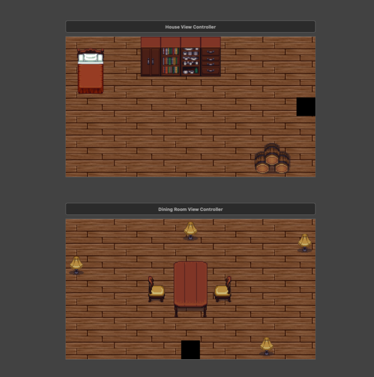

<p align="center">
    
</p>

A simple 2D UIKit game engine to make a simple beautiful iOS Games!

## It's Just a UIKit!

The main goal of this project is to use the storyboard and UIKit components to build 2D games!.


<p>
You can check <a href="https://github.com/Abedalkareem/Zaina-iOS">Zaina</a> game to have the full source code
</p>

## How to use

### Game view controller
First step is to inherit the `BaseGameViewController` it will notify you when:
1- Two objects collide.
```
override func objectsDidCollide(object1: ObjectView, object2: ObjectView) -> Bool {
  switch (object1.type, object2.type) {
  case (CollideTypes.virus, CollideTypes.whiteCell):
    return collideBetween(virus: object1, whiteCell: object2)
  case (CollideTypes.whiteCell, CollideTypes.virus):
     return collideBetween(virus: object2, whiteCell: object1)
   default:
     break
   }
   return true
}
```

2- The game pause or resume.
```
override func didPause() {
  showPauseDialog()
  stopBloodTimer()
  stopWhiteTimer()
}

override func didResume() {
  startBloodTimer()
  startWhiteTimer()
}
```

Also, it will allow you to pause resume the game using `paused` property.

```
paused = true // to pause the game.
paused = false // to resume the game.
```

### Scene view

It's where your `SpriteView`s and `NodeView`s  should be added. In the `BaseGameViewController` you will find an `IBOutlet`
with a type of `SceneView` you need to connect this `IBOutlet` to your Storyboard `SceneView`.

### Sprite view

### Node view

### FramesHolder and Frames

### 

## License

```
The MIT License (MIT)

Copyright (c) 2019 Abedalkareem

Permission is hereby granted, free of charge, to any person obtaining a copy
of this software and associated documentation files (the "Software"), to deal
in the Software without restriction, including without limitation the rights
to use, copy, modify, merge, publish, distribute, sublicense, and/or sell
copies of the Software, and to permit persons to whom the Software is
furnished to do so, subject to the following conditions:

The above copyright notice and this permission notice shall be included in all
copies or substantial portions of the Software.

THE SOFTWARE IS PROVIDED "AS IS", WITHOUT WARRANTY OF ANY KIND, EXPRESS OR
IMPLIED, INCLUDING BUT NOT LIMITED TO THE WARRANTIES OF MERCHANTABILITY,
FITNESS FOR A PARTICULAR PURPOSE AND NONINFRINGEMENT. IN NO EVENT SHALL THE
AUTHORS OR COPYRIGHT HOLDERS BE LIABLE FOR ANY CLAIM, DAMAGES OR OTHER
LIABILITY, WHETHER IN AN ACTION OF CONTRACT, TORT OR OTHERWISE, ARISING FROM,
OUT OF OR IN CONNECTION WITH THE SOFTWARE OR THE USE OR OTHER DEALINGS IN THE
SOFTWARE.
```
